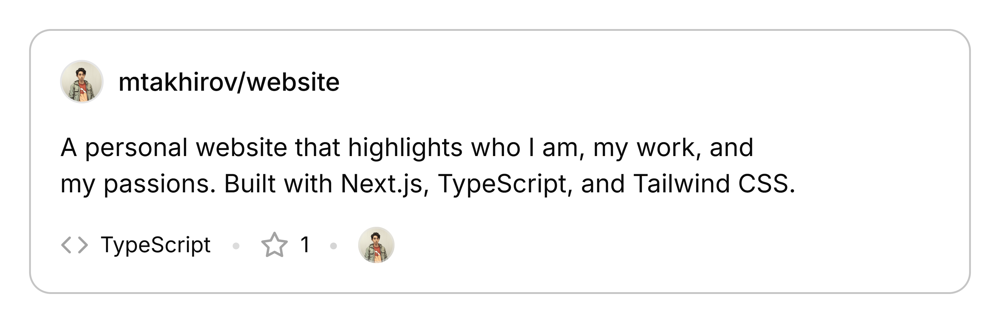
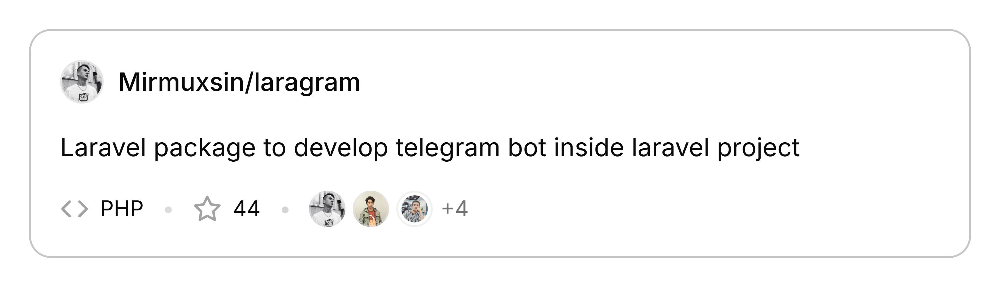
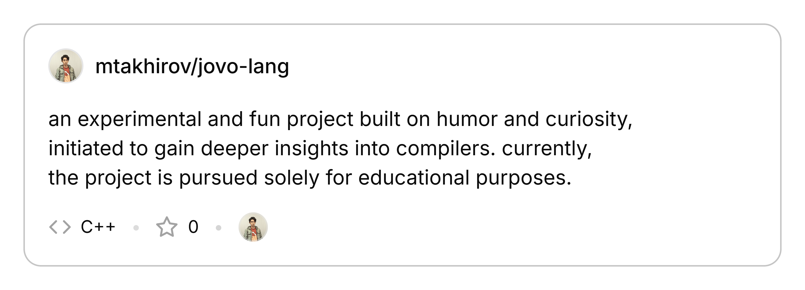
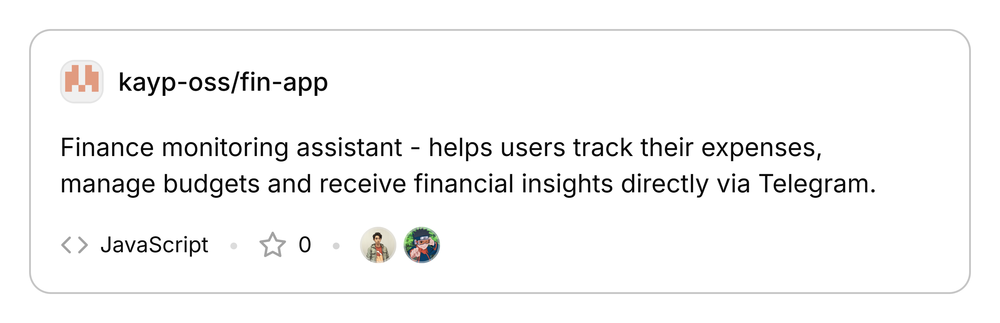

<h1 align="center">
  <samp>Hi there, I'm Mukhammaddiyor 👋</samp>
</h1>

  <em><samp>Full Stack Developer | Tech Explorer</samp></em>

---

<h2>
  <samp>Projects</samp>
</h2>

  <a href="https://github.com/mtakhirov/website">
    <picture>
      <source media="(prefers-color-scheme: dark)" srcset="./assets/projects/website.png">
      
    </picture>
  </a>

  <a href="https://github.com/mirmuxsin/laragram">
    <picture>
      <source media="(prefers-color-scheme: dark)" srcset="./assets/projects/laragram.png">
      
    </picture>
  </a>

  <a href="https://github.com/mtakhirov/jovo-lang">
    <picture>
      <source media="(prefers-color-scheme: dark)" srcset="./assets/projects/jovo-lang.png">
      
    </picture>
  </a>

  <a href="https://github.com/kayp-oss/fin-app">
    <picture>
      <source media="(prefers-color-scheme: dark)" srcset="./assets/projects/fin-app.png">
      
    </picture>
  </a>

---

  <a href="https://takhirov.uz/"><samp>website</samp></a> •
  <a href="https://t.me/mtakhirov"><samp>tg:mtakhirov</samp></a> •
  <a href="https://x.com/mtakhirov"><samp>x/twitter:mtakhirov</samp></a> •
  <a href="mailto:oss@takhirov.uz"><samp>mail:oss@takhirov.uz</samp></a>

 
