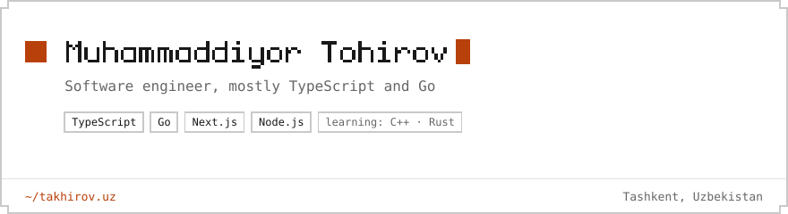
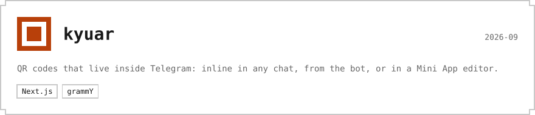
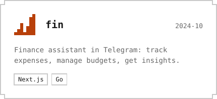
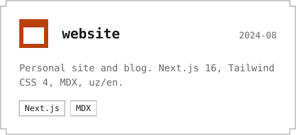
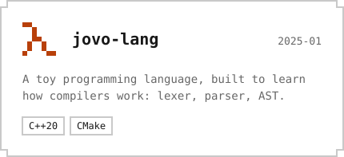
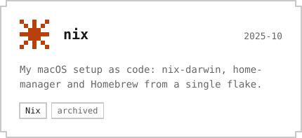

<a href="https://takhirov.uz">
  <picture>
    <source media="(prefers-color-scheme: dark)" srcset="./assets/header-dark.svg">
    
  </picture>
</a>

I have spent half my life talking to computers. These days I mostly work on
architecture and scaling, in Node.js and Go. Right now I am learning C++ and Rust.

### <samp>projects</samp>

<a href="https://github.com/flakeforge/kyuar">
  <picture>
    <source media="(prefers-color-scheme: dark)" srcset="./assets/projects/kyuar-dark.svg">
    
  </picture>
</a>

<a href="https://github.com/flakeforge/fin">
  <picture>
    <source media="(prefers-color-scheme: dark)" srcset="./assets/projects/fin-dark.svg">
    
  </picture>
</a>
<a href="https://github.com/mtakhirov/website">
  <picture>
    <source media="(prefers-color-scheme: dark)" srcset="./assets/projects/website-dark.svg">
    
  </picture>
</a>
<a href="https://github.com/mtakhirov/jovo-lang">
  <picture>
    <source media="(prefers-color-scheme: dark)" srcset="./assets/projects/jovo-lang-dark.svg">
    
  </picture>
</a>
<a href="https://github.com/mtakhirov/nix">
  <picture>
    <source media="(prefers-color-scheme: dark)" srcset="./assets/projects/nix-dark.svg">
    
  </picture>
</a>

### <samp>elsewhere</samp>

<samp>
<a href="https://takhirov.uz">takhirov.uz</a> ·
<a href="https://t.me/mtakhirov">telegram</a> ·
<a href="https://x.com/mtakhirov">x</a> ·
<a href="mailto:opensource@takhirov.uz">opensource@takhirov.uz</a>
</samp>
