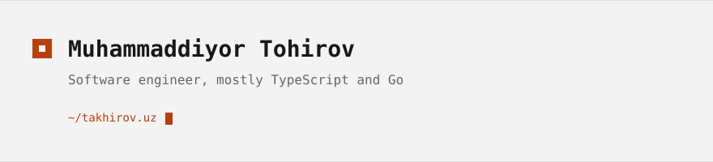

<!-- Variant B — Brand. SVG header in takhirov.uz colours (dark #101010 / accent #ff7b1c,
     light #f3f3f3 / accent #b8400a), dark/light switch via <picture>. Projects as a table:
     text only, no screenshots to maintain. Needs assets/header-dark.svg + header-light.svg. -->
<a href="https://takhirov.uz">
  <picture>
    <source media="(prefers-color-scheme: dark)" srcset="./assets/header-dark.svg">
    
  </picture>
</a>

I have spent half my life talking to computers. These days I mostly work on
architecture and scaling, in Node.js and Go. Right now I am learning C++ and Rust.

### <samp>projects</samp>

| | | |
| --- | --- | --- |
| **[kyuar](https://github.com/flakeforge/kyuar)** | QR codes that live inside Telegram: inline, bot, Mini App editor | `Next.js` `grammY` |
| **[fin](https://github.com/flakeforge/fin)** | Finance monitoring assistant in Telegram | `TypeScript` |
| **[website](https://github.com/mtakhirov/website)** | Personal site and blog, uz/en | `Next.js` `MDX` |
| **[jovo-lang](https://github.com/mtakhirov/jovo-lang)** | A toy programming language, built to learn compilers | `C++20` |
| **[nix](https://github.com/mtakhirov/nix)** | My macOS setup as code | `Nix` |

### <samp>elsewhere</samp>

<samp>
<a href="https://takhirov.uz">takhirov.uz</a> ·
<a href="https://t.me/mtakhirov">telegram</a> ·
<a href="https://x.com/mtakhirov">x</a> ·
<a href="mailto:opensource@takhirov.uz">opensource@takhirov.uz</a>
</samp>
